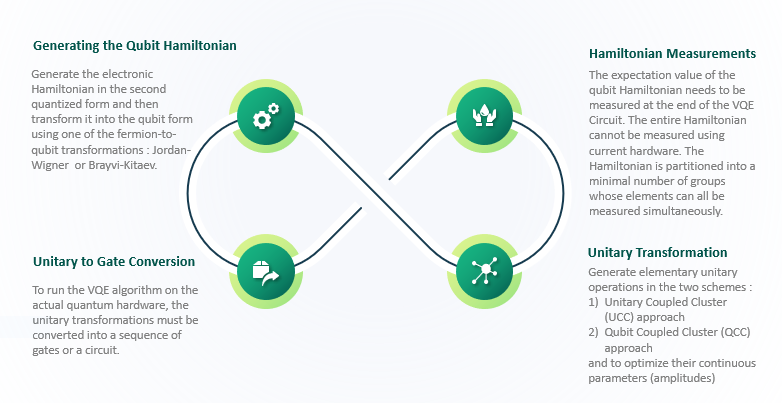
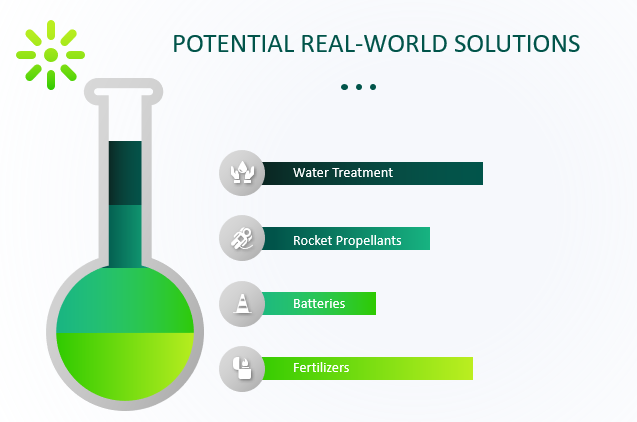
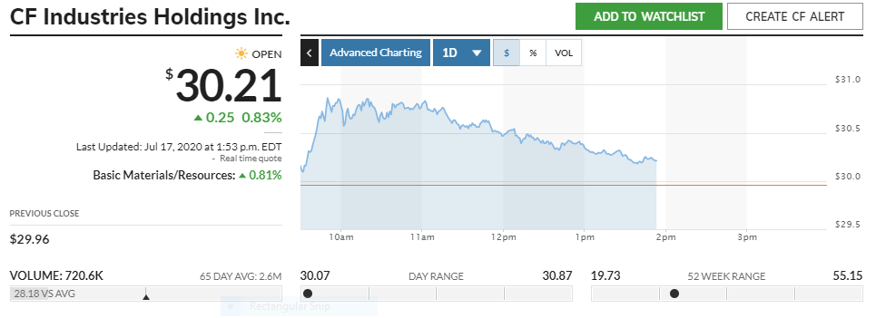

# Quantum Cohort Project Business Application

## Step 1: Explain the technical problem you solved in this exercise

<<<<<<< HEAD
## Step 1: Explain the technical problem you solved in this exercise

The main goal of this exercise was to implement VQE in order to find the parameters that generate the fundamental state of different molecules in a quantum circuit. This included the following tasks:

- In the first task, we reviewed different approximations commonly used for estimating analytically the ground state of a many body system. These included:
    - Hartree Fock, where a single Slater determinant is proposed (no correlations)
    - Coupled Cluster methods, which are a refinement of Hartree Fock where one and two body operators are considered.
    - We also considered exact solutions, known as Full configuration interactions, where all interactions are considered.
    
- Then we analysed the corresponding qubit Hamiltonian using Jordan Wigner. The tapering technique was introduced to lower the complexity of the resulting operator by exploiting symmetries.
- In order to use VQE, we must generate the unitaries. In this task we explored 2 types, choosing between sto-3g and sto-6g basis depending on the molecule and its complexity:
    - Unitary Coupled Cluster: a direct generalization of the Coupled Cluster method. This is a “fermionic” approach.
    - Qubit Coupled Cluster: we look directly to the qubit space, optimized for a quantum circuit. This method is better for translating to existing hardware.
- In order to measure the expectation value of the Hamiltonian, complicated measures have to be made. We explored how to partition these operators into a minimal number of groups such that each member can be fully measured at the same time.
- In this final step, we converted the unitaries obtained in previous steps to gate-based algorithms able to run in existing hardware. 
We performed this task for H2, LiH and H4. Additionally, further challenges were addressed.
- We explored the framework Qulacs to simulate noise aware quantum systems in order to find the first excited state of a H2 molecule, by using VQE and orthogonality with the fundamental state.
- We analyzed and solved the Max-Cut problem with VQE. This problem is known to be NP-complete and can be significantly sped up with hybrid methods.
- We used PennyLane framework to find the  ground state of the H$_2$O molecule with FCI and tapering techniques.
=======
We use Variational Quantum Eigensolver (VQE) to obtain the potential energy surfaces (PES) for small molecules. Currently, the variational quantum eigensolver (VQE) is the most feasible technique for solving the electronic structure problem on a near term nosiy quantum computers. We study the PES for following molecules using both classical and quantum methods : H2, LiH, H2O and N2. H2 and LiH are weakly correlated while H2O and N2 are strongly correlated systems. Classical state-of-the-art methods like CCSD fail to perform accurate calculations for strongly correlated systems. Thus, quantum computing methods based on VQE provide a potential solution to this problem. These methods not only promise to efficiently perform calculations of larger and complex systems with improved chemical accuracy [1], but also provide an ability to calculate additional properties like charge density, dipole moment etc.[2]

The quantum subroutine has two fundamental steps :
1) Prepare the quantum state called ansatz.
2) Measure the expectation value.

The variational principle bound allows us to use classical computation to run an optimization loop to find their eigenvalue :
1) Use a classical, non-linear optimizer to minimize the expectation value by varying ansatz parameters.
2) Iterate until convergence.

 

>>>>>>> upstream/master

## Step 2: Explain or provide examples of the types of real-world problems this solution can solve
VQE provides an enormous speed up for certain optimization problems. Among these, the Max-Cut problem is of significant importance for circuit design. Better solutions to these problems would have an enormous impact both on scalability and cost reductions for technological developers.

<<<<<<< HEAD
- Microprocessors and Memory chips have a combined market share of approximately 330 billion dollars of revenue per year, with fast increasing numbers. [[1]](https://www.grandviewresearch.com/industry-analysis/microprocessor-market) [[2]](https://www.globenewswire.com/news-release/2020/02/07/1981735/0/en/Global-Memory-Chips-Market-Worth-241-Billion-by-2023-Rising-at-a-CAGR-of-22.html)
- Inside each of these components, there are up to 2 trillion transistors [[3]](https://ourworldindata.org/uploads/2019/05/Transistor-Count-over-time-to-2018.png). The way in which these transistors are distributed is fundamental for the scalability and correct functioning of the chips. This problem is known as Very Large Scale Integration (VLSI).  
- Due to lithography and etch issues with scaling, design rules for layout have become increasingly stringent. Nowadays, computers are used to simulate and find optimal strategies. 
- These geometry problems can be reduced to the Max-Cut problem in graphs [[4]](https://www.jstor.org/stable/170992?seq=1)[[5]](https://www.semanticscholar.org/paper/Network-Design-Using-Cut-Inequalities-Barahona/b683bc4caf9225056c78af45f9748de2648555e6), which are known to be NP-complete [[6]](https://dl.acm.org/doi/10.1145/800157.805047)
- VQE methods use hybrid classical-quantum technologies to solve Max-Cut problems with significant speed ups. 
- Providing better mathematical solutions would allow for smaller and more efficient chips.

## Step 3: Identify at least one potential customer for this solution - ie: a business who has this problem and would consider paying to have this problem solved

In recent years, there has been a significant increase in the demand for chip driven products. Seeing this phenomenal market demand and with the design and manufacturing market (both domestic and international) expanding rapidly, there is an enhanced demand for algorithms that improve the optimization and design techniques that are used today.

**Market Opportunity:** The integrated circuits market has grown continuously from its beginning to the present. In 2019, the market reached 330 billion dollars in revenues and this value is estimated to continue growing in the coming years according to the business data platform Statista.

**Target Customers:** Companies engaged in large-scale manufacturing of semiconductors and integrated circuits (IC) interested in innovation:

- Intel Corporation
Revenue: $72 billions [[Intel]](https://www.intc.com/investor-relations/investor-education-and-news/investor-news/press-release-details/2020/Intel-Reports-Fourth-Quarter-2019-Financial-Results/#:~:text=In%202019%2C%20Intel%20generated%20a,revenue%20of%20approximately%20%2419.0%20billion.)
- Samsung
Revenue: $218 billion U.S. dollars [[Samsung]](https://news.samsung.com/global/samsung-electronics-announces-fourth-quarter-and-fy-2019-results)
- Texas Instruments
    Revenue: $14 billions [[Forbes]](https://www.forbes.com/sites/greatspeculations/2020/01/28/after-dropping-in-2019-can-texas-instruments-revenue-cross-15-billion-by-2021/#65a5b52b642c)
- Advanced Micro Devices (AMD)
Revenue: $6 billions [[AMD]](https://ir.amd.com/news-releases/news-release-details/amd-reports-fourth-quarter-and-annual-2019-financial-results)
- IBM
Revenue: $77 billions [[IBM]](https://newsroom.ibm.com/2020-01-21-IBM-Reports-2019-Fourth-Quarter-and-Full-Year-Results#:~:text=Full%2DYear%202019%20Results&text=Consolidated%20net%20income%20was%20%249.4,for%20the%20full%2Dyear%202018.)
- Toshiba
Revenue: $33 billions [[Macrotrends]](https://www.macrotrends.net/stocks/charts/TOSYY/toshiba/revenue)
- Nvidia
Revenue: $11 billions [[Forber]](https://www.forbes.com/sites/greatspeculations/2020/01/07/after-growing-almost-70-over-the-last-2-years-why-is-nvidias-revenue-expected-to-grow-only-4-by-2021/#6d5bbb1b79b8)

## Step 4: Prepare a 90 second video explaining the value proposition of your innovation to this potential customer in non-technical language

Link to video: https://youtu.be/5AEUMR-K0BI 

=======
**On the path of achieving quantum advantage for real world applications....**

There are a number of real world problems this solution can solve, including water treatment, fertilizer manufacturing and more efficient battery production processes.

**Water Treatment** : This market is valued at USD 23.80 billion in 2016. It is expected to register a CAGR of 7.1% by 2025. The industry can be classified into residential and non-residential segments. The residential segments account for 115.2 million units. Exponential growth in residential construction across the world is expected to contribute significantly to the growth of this application segment. The world’s move toward greener chemistry — the reduction of hazardous substances in producing chemicals and reducing pollution — requires new ways to replace organic solvents with water, to better understand water’s role in reaction mechanisms, and to better understand how solutes and toxins partition into the environment. Better ways are needed to separate water from other materials, such as organic solids, bacteria, and hydrocarbons. To learn how material properties are encoded within molecular structures requires more than just experiments. It also requires models, theories, and simulations. Without modeling, we cannot interpret observable properties in terms of water’s molecular structure, energetics, and statistical distributions.[3]

**Fertlizer Manufacturing** : Creating energy efficient processes to manufacture ammonia is a $11 billion problem without a solution. Ammonia is currently produced through the Haber-Bosch process, which utilizes a synthetic reaction with hydrogen and nitrogen gas. This requires extremely high pressure and temperature conditions as well as an expensive metal catalyst. The application of quantum computing capabilities to simulate the dissociation of the triple bond in the nitrogen molecule will help to create a more energy efficient methof of ammonia synthesis.[8]

**Chemical Industry** : Lithium hydride is used in the production of a variety of reagents for organic synthesis, such as lithium aluminium hydride (LiAlH4) and lithium borohydride (LiBH4). Thus studying it's structure and properties can be imperative in identifying new efficient methods to produce reagents.[4]

**Efficient Battery Production** : A current disadvantage of electric vehicles is the capacity and speed of charging of their batteries. Besides electric vehicles, many smartphone batteries are based on lithium ion- fast charging and efficient storage is a current hot problem that needs to be solved. A lithium ion battery costs between $7000-$20000 for a vehicle thereby making it most expensive item in cost of vehicle. Additionally, inefficient charging increases electricity consumption. A step towards efficient energy storage and charging mechanisms can reduce electricity consumption too. Quantum computers can be used to model the dipole moment of three lithum containing molecules, bringing us closer to the next-generation lithium sulfur (Li-S)[7] batteries that would be more powerful, longer lasting and cheaper than today’s widely used lithium ion batteries.[5]

**Small Rocket Propellants** : LiH has been studied as potential nuclear rocket propellant along with Liquid Hydrogen. Currently, the feasibility of using LiH as a nuclear rocket propellant appears remote without the removal of at least all but 1% of the Li/sup 6/ from the Li. Quantum simulation can be used to study this further at a faster and cheaper rate, thus potentially impacting the field of space exploration significantly in the future.[6]

## Step 3: Identify at least one potential customer for this solution - ie: a business who has this problem and would consider paying to have this problem solved

**Fertilizer Manufacturing** : CF Industries, a global leader in nitrogen fertilizer manufacturing and distribution, owns and operates world-scale nitrogen complexes and serves agricultural and industrial customers through its best-in-class distribution system. It produces more than $8.5 million short tonnes of ammonia annually.

Company Information :

CF Industries Holdings, Inc. engages in the manufacture and distribution of nitrogen fertilizer. The firm owns and operates nitrogen plants and serves agricultural and industrial customers through its distribution system. It operates through following segments: Ammonia, Granular Urea, UAN, AN, and Other. The Ammonia segment produces anhydrous ammonia, which is company's most concentrated nitrogen fertilizer product as it contains 82% nitrogen. The Granular Urea segment produces granular urea, which contains 46% nitrogen. The UAN segment produces urea ammonium nitrate solution, which is a liquid fertilizer product with a nitrogen content from 28% to 32%, is produced by combining urea and ammonium nitrate. The AN segment produces ammonium nitrate, which is a nitrogen-based product with a nitrogen content between 29% and 35%. The Other segment includes diesel exhaust fluid, nitric acid, urea liquor and aqua ammonia. The company was founded in 1946 and is headquartered in Deerfield, IL.[9]

**Water Treatment** : Every industry that produces waste water is required to apply initial treatment to it before releasing it in environment. So that opens up room for a lot of potential customers especially in chemical industries like Hydronova, Olin etc. where separating water from other toxins is a difficult problem.

**Rocket propellent** : SpaceX , NASA, RocketLab etc.

**Efficient Battery Storage** : Smartphone companies like Samsung, Apple etc. and electric car comapnies like Tesla, Chevrolet, Nissan are potential customers for this application. 

## Step 4: Prepare a 90 second video explaining the value proposition of your innovation to this potential customer in non-technical language

https://www.youtube.com/watch?v=__A3Da354DE&feature=youtu.be
>>>>>>> upstream/master
